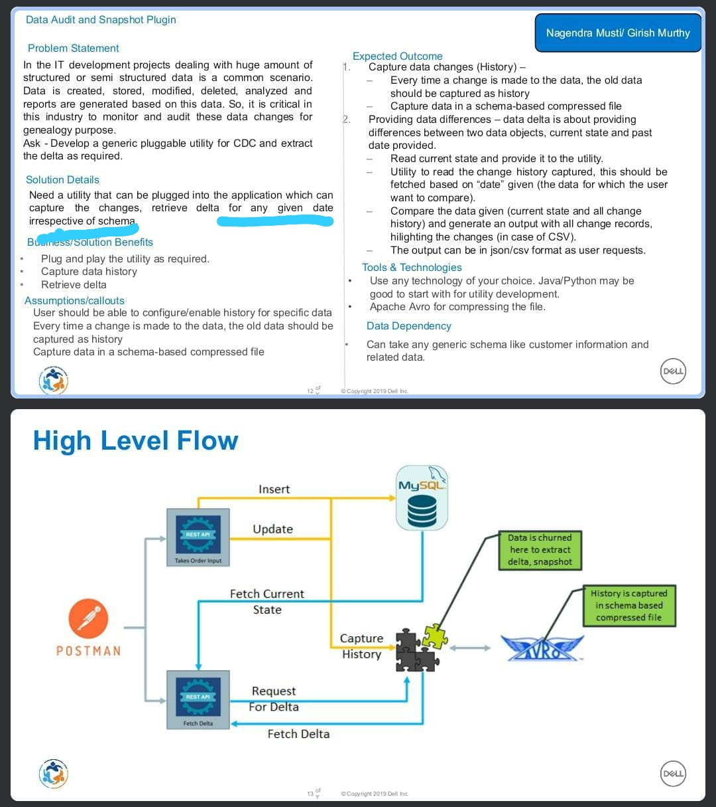

# Data Vine

---

This is a solution of a problem out team choosed during Dell hack to hire hackathon.

> #### Problem Statement
>
> 

This is a python based project. Change your api.py file and api2.py accordingly.
Also, you have to create the db according to your api's.
The documentation of the library **Data Vine** will be uploaded soon.

> First install all the dependecies
>
> `pip install -r requirements.txt`
